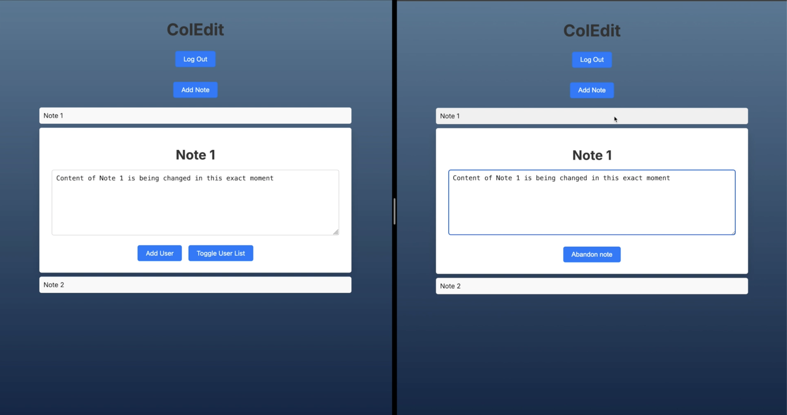

# Coledit: Collaborative Note Taking Web Application

## Overview
A collaborative note-taking application allowing a number of users to work on notes simultaneously. 
It features automatic conflict resolution through server-side merging and real-time updates via WebSockets. 
The application emphasizes security with Spring Security and JWT tokens, uses Next.js for the frontend,
Java for the backend, JPA for database interactions, and Nginx for reverse proxying. 
Docker Compose facilitates both development and deployment environments.

## Motivation
The motivation behind Coledit was to create a seamless and secure mini platform for collaborative note-taking. It aims to provide a simplistic web-based note taking application allowing for small scale collaborative sessions for brainstorming in a single or multi-user environment. It takes out the hassle of overcomplicated and sometimes unresponsive heavy weight apps, with a minimalistic and snappy experience.

## Quick Start and Demo Video

Watch the quick start and demo video on YouTube to get up and running quickly:

[Click here to watch the full video on YouTube](https://youtu.be/9jYv1yGno2c?si=c9vxnXclduCuz_Nb)


## Architecture
Coledit follows a Controller-Service-Repository REST architecture pattern, which promotes separation of concerns and enhances maintainability. The frontend and backend run on different ports, providing clear separation. The frontend, backend, database and reverse-proxy run as already configured docker containers, making it easier to try out everything on your own machine out of the box.

**Technology Stack**:
  - Frontend: Next.js
  - Backend: Java
  - Database Interaction: JPA
  - Database: PostgreSQL
  - Reverse Proxy: Nginx
  - Development & Deployment: Docker Compose

## Features
- **Real-Time Collaboration**: Multiple users can edit the same note concurrently.
- **Conflict Resolution**: Server merges changes in case of conflicts on the same version. This is why I have not implemented collaborative visual mouse pointers for all collaborators on a note.
- **Fast Refresh**: WebSockets enable quick updates on notes.
- **Spring Security & JWT**: Secure access through Spring Security and JSON Web Tokens (JWT). 

# Focus of the application:
- **String Merger**: A custom implementation for merging different versions of strings, available in `StringMerger.class`. To understand how this implementation works the StringMergerTest contains explanations and examples.
- **Custom Authorization Filter**: Prevents unauthorized manipulations via `JwtAuthorizationFilter.class`. Ensures actions like note creation/deletion are restricted to the rightful owner even with URL or payload tampering.
- **Web Socket Connection Handler**: A websocket handler optimized for collaborative document editing, keeping track for each documents information such as latest version instance and number. To understand the threading logic you can read the notes left at backend/src/main/java/com/coledit/backend/handlers/SocketConnectionHandler.java.

## Getting Started
While in the root of the project you can follow:

### Development Setup
To start the application in development mode, run:
```zsh
docker compose -f compose.yml -f compose.dev.yml up --build --watch 
```

### Deployment Setup
To start the application in regular mode, run:
```zsh
docker compose up
```

### Running Tests
To execute backend tests, use:
```zsh
docker exec -it backend mvn test
```
### NOTICE
For the application to work properly, add the /certificates/localhost.crt to trusted certificates on your machine.

You can open two different browsers. To access the frontend of the application enter the following URL in your preferred browsers: https://localhost/

Log in with the provided email addresses and passwords. Use one for each browser tab:

- **Email**: user1@example.com, **Password**: pass1
- **Email**: user2@example.com, **Password**: pass2

You can then proceed to experiment with the application as you want, or as shown in the tutorial video.

#### Miscelaneous
Initially, the application was designed to include roles such as admin, which would allow certain users to add other users. However, roles are no longer utilized in the current implementation, as they did not prove useful.

Some methods in the NoteController, as well as the entire UserController, were found to be unnecessary. Instead of deleting or commenting out these methods, I disabled them using annotations.


# In-App Screenshot


